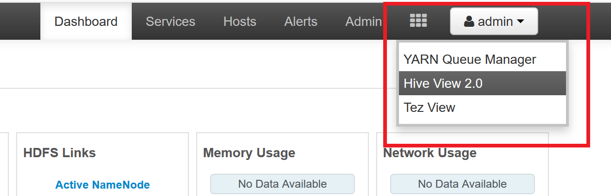
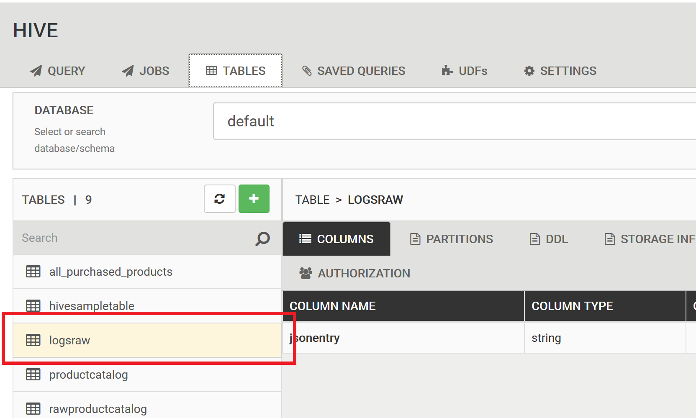

# Lab 2: Data ETL (Extract, Transform, Load)

在這份 Lab 中您將瞭解並建立資料管線 (data pipeline) 的基礎建設

## Step 1: 建立需要的 Azure 服務

  * [Azure Storage](https://azure.microsoft.com/services/storage/blobs/): 我們需要建立另一個儲存體帳號來存放 HDInsight 的資料。
  * [Azure SQL Database](https://azure.microsoft.com/services/sql-database/): 用來儲存資料 ETL 過程中的 meta data
  * [Azure HDInsight](https://azure.microsoft.com/services/hdinsight/): 在這個 Lab 中我們以 Hive 來示範 ETL 的操作，所以建立一個 Hadoop cluster 來操作。
  * (選擇性) [Azure Data Factory](https://azure.microsoft.com/services/data-factory/): 用來設定資料管線的自動化。

以下是建立資源的步驟以及建議選項。

1. 建立 Azure 儲存體帳戶，這部份的原則與 [Lab1](Lab1-Data-Ingestion.md) 操作時相似，只是這裡我們單純用它來存放 HDInsight cluster 所產生的檔案或 logs。

2. 建立 Azure SQL Database，效能可以選擇 **S0** 即可，而建立時注意位置要選擇與 Lab1 建立的資源相同的資料中心位置。

3. 建立 Azure HDInsight 資源 (注意選擇發行商為 Microsoft 的版本)：（您可以視需要自行調整叢集大小，或是保留預設值）

   * 基本設定
      * 叢集類型選擇 **Hadoop**、**Linux**、以及 **Hadoop 2.7.3 (HDI 3.6)**。
      * 帳號密碼是稍後用來登入 web 操作界面的身份認證用。
      * 位置與已建立的儲存體帳戶相同。
   * 儲存體
      * 儲存體的設定分成兩塊，一開始設定的是 HDInsight 所用的儲存體帳戶，你可以選擇稍早建立的儲存體，或是在這裡再新建一個；而在 **其他儲存體帳戶** 裡就要設定我們用來儲存資料的儲存體帳戶金鑰，這樣才能使用這個 HDInsight 來操作儲存的資料。
      * 中繼資料存放區可以將剛才建立的 SQL 資料庫設定在 _為 Hive 選取 SQL 資料庫_ 欄位。

   接下來可以要大約 20 分鐘左右，整個 cluster 才會建立完成。

## Step 2: 在 HDInsight 中載入資料並存成 Hive table

1. 根據建立的 HDInsight cluster 內容，打開瀏覽器連結 https://xxxx.azurehdinsight.net/ 登入 cluster 的 web 管理界面 (Ambari)，登入後在右上角的按鈕切換成 **Hive view**。

   


2. 提交一個 Hive query 如下 (儲存體帳號名稱，以及路徑中的日期請根據真實情況做修改) ，_這個查詢就是主要把資料從 Blob 儲存體讀進來，並且產生一個 hive table 來儲存它_。順利完成後，可以在填寫查詢的右側面板或是 _TABLE_ 頁面觀察是不是有建立 `logsraw` 的 Hive table。

    ```
    CREATE EXTERNAL TABLE IF NOT EXISTS LogsRaw (jsonentry string) PARTITIONED BY (year INT, month INT, day INT) STORED AS TEXTFILE LOCATION "wasbs://logs@example.blob.core.windows.net/";
    
    ALTER TABLE LogsRaw ADD IF NOT EXISTS PARTITION (year=2017, month=10, day=31) LOCATION "wasbs://logs@example.blob.core.windows.net/2017/10/31";
    
    SELECT * from LogsRaw limit 1;
    ```

   