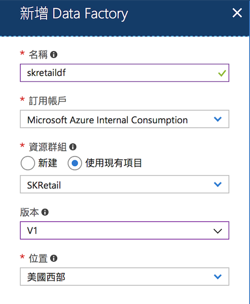

# Lab 4: Data Pipeline Automation (Orchestration)

在這個 Lab 中您將會學習到如何使用 Azure Data Factory 來將整個資料管線 (data pipeline) 串接起來並且排程執行。

## Step 1: 建立需要的 Azure 資源

這裡我們主要就是使用 [Azure Data Factory](https://azure.microsoft.com/services/data-factory/)，所以只需建立這個服務即可。而由於 Data Factory 只是編寫資料管線的定義以及驅動它執行，所以 **Data Factory 不必與資料管線建立在同一機房**。

在這個 lab 中我們使用 **V1** 的版本。

