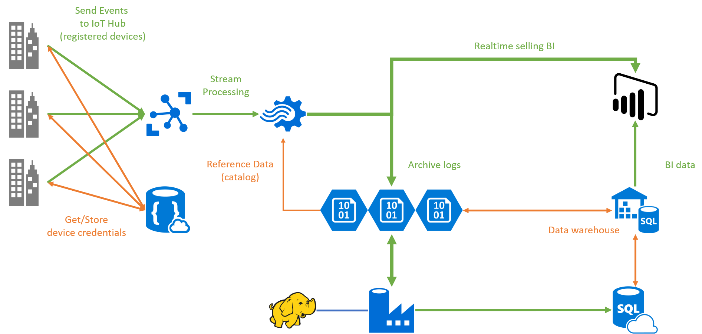

# Retail IoT Sample

This project shows how to bring IoT and Big Data scenario to transform the retail store business.

Detail article is [here](https://medium.com/@ericsk/以零售為例-動手實作以資料驅動的商業決策系統-938c42f394fc) (Traditional Chinese).

# Projects

* **POSSimulator**: Generate retail events and send the events to the Azure IoT Hub.
* **ASA**: The events sent to Azure IoT Hub are processed by Azure Stream Analytics. This folder contains the configurations and the stream processing queries.
* **ref**: The assets for the projects. See _details_.
* **HDInsight**: The Hive queries to transform data from unstructured (JSON) log to tabular (Hive table) data.
* **SQL Data Warehouse**: SQL Data Warehouse query scripts.
* **Azure Data Factory**: Azure Data Factory pipeline definitions.

# Code of Conduct
This project has adopted the [Microsoft Open Source Code of Conduct](https://opensource.microsoft.com/codeofconduct/). For more information see the [Code of Conduct FAQ](https://opensource.microsoft.com/codeofconduct/faq/) or contact [opencode@microsoft.com](mailto:opencode@microsoft.com) with any additional questions or comments.
